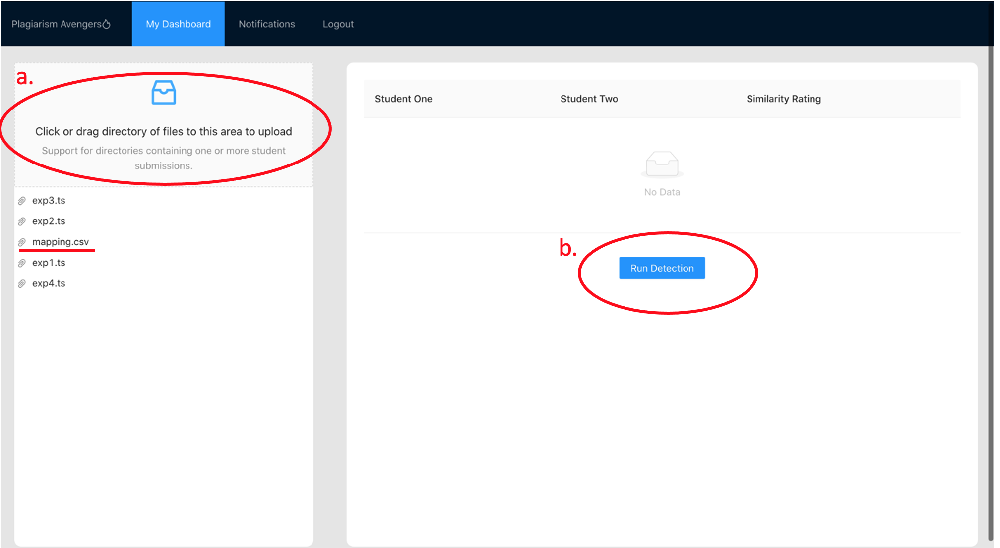
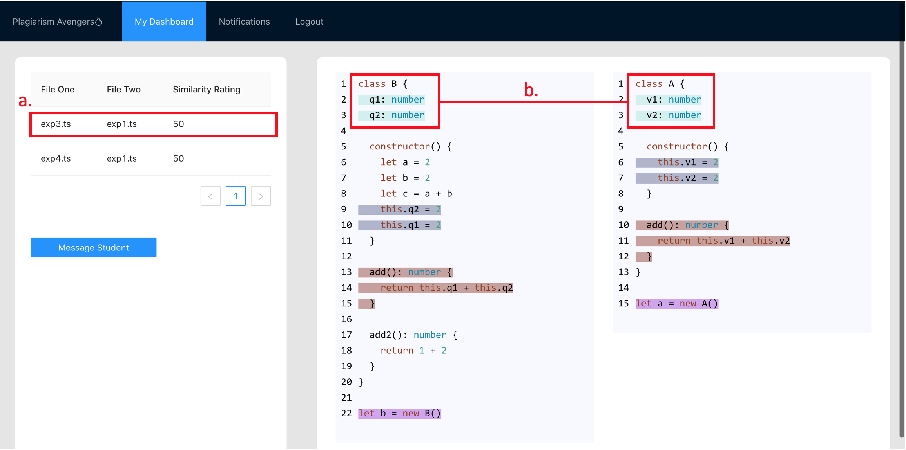

# Team 18 (Plagiarism Avengers) 💫

## 1.1 Installation: 

- Download repository: https://github.ccs.neu.edu/CS-4530-5500-Fall-2020-Term-Project/Team-18 
- Unzip file 
- Open Team-18/server in terminal or command line
- Run npm start to start server 
- Open Team-18/frontend in terminal or command line 
- Run npm start to start React server 
- Web app should open in your default web browser or you can open http://localhost:3000/ to access the application. 

 

## 1.2 Instructor Specific Guide: 
- Click on “Start New Project” 
- Click on “Create Project”
- Run an analysis (see image below)
  - Drag and drop the provided Submission Directory folder.
  - Please have a mapping.csv file maps sample files to sample student emails in the root of the folder to be uploaded. 
  - First value of the row should indicate the student’s email 
  - Second value of the row should indicate the relative path of the file.       
  - It mimics the that a professor would get when they download project submissions from a platform such as canvas
  

  

- Click on any row that appears in the table 
- View analysis (see image below) 

- Click on a row to see a comparison view of File One (left) and File Two (right) 
- Similar code is highlighted in the same color 
- Click “Message Student” if further action is required. Compose message and click “Send” 

## 1.3 Student Specific Guide:
- Click on any row to view a message 
- Click “View Report” to see the analysis of your code 
- You may follow-up with your instructor via email if you have any complaints 
